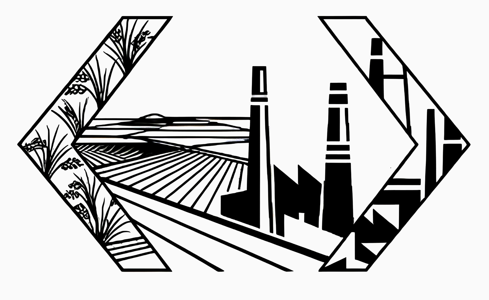

# 🚀 KarawangDev - Komunitas Developer Karawang

<div align="center">
  
  
  [](https://karawangdev.vercel.app)
  [](https://github.com/karawangdev/karawangdev/stargazers)
  [](https://github.com/karawangdev/karawangdev/network/members)
  [](https://github.com/karawangdev/karawangdev/graphs/contributors)
</div>

## 🌟 Tentang KarawangDev

**KarawangDev** adalah komunitas developer di Karawang yang bertujuan untuk:
- 🤝 **Berkolaborasi** dalam proyek-proyek teknologi
- 📚 **Berbagi ilmu** melalui workshop dan seminar
- 🚀 **Mengembangkan skill** programming dan teknologi
- 🌐 **Membangun ekosistem** teknologi di Karawang
- 💡 **Menginspirasi** generasi developer masa depan

## ✨ Features Website

- 🏠 **Homepage** dengan hero section dan overview komunitas
- 👥 **About Page** dengan profil anggota dan visi misi
- 📅 **Event Management** dengan listing dan detail event
- 🎯 **Join Page** untuk pendaftaran anggota baru
- 📱 **Responsive Design** untuk semua perangkat
- ⚡ **Modern Animations** dengan Framer Motion
- 🎨 **Glassmorphism UI** dengan Material-UI

## 🛠️ Tech Stack

### Frontend
- **Framework:** Next.js 15 with TypeScript
- **UI Library:** Material-UI (MUI)
- **Animations:** Framer Motion
- **Icons:** Material-UI Icons
- **Fonts:** Montserrat, Inter

### Development Tools
- **Language:** TypeScript
- **Linting:** ESLint
- **Package Manager:** npm
- **Version Control:** Git

### Deployment
- **Hosting:** Vercel
- **Domain:** Custom domain ready
- **CI/CD:** GitHub Actions

## 🚀 Quick Start

### Prerequisites
- Node.js 18+ 
- npm atau yarn
- Git

### Installation

1. **Clone repository**
```bash
git clone https://github.com/karawangdev/karawangdev.git
cd karawangdev
```

2. **Install dependencies**
```bash
npm install
# atau
yarn install
```

3. **Run development server**
```bash
npm run dev
# atau
yarn dev
```

4. **Open browser**
```
http://localhost:3000
```

### Available Scripts

```bash
# Development dengan hot reload
npm run dev

# Development dengan Turbopack (faster)
npm run dev:turbo

# Build untuk production
npm run build

# Start production server
npm run start

# Linting
npm run lint
```

## 📂 Project Structure

```
karawangdev/
├── app/                      # Next.js App Router
│   ├── (routes)/            # Route groups
│   │   ├── about/           # About page
│   │   ├── events/          # Events pages
│   │   └── join/            # Join page
│   ├── components/          # React components
│   │   ├── ui/              # UI components
│   │   ├── about/           # About page components
│   │   ├── events/          # Event components
│   │   └── join/            # Join page components
│   ├── globals.css          # Global styles
│   └── layout.tsx           # Root layout
├── public/                  # Static assets
│   ├── logo.jpg            # Community logo
│   ├── events-placeHolder.webp
│   └── speaker-*.png
├── next.config.ts          # Next.js configuration
├── package.json            # Dependencies
├── vercel.json            # Vercel deployment config
└── README.md              # Documentation
```

## 🎯 Roadmap

### 🔥 Phase 1 - Foundation (Current)
- [x] Website design dan development
- [x] Event management system (frontend)
- [x] Member registration flow
- [x] Responsive design
- [x] SEO optimization

### ⚡ Phase 2 - Backend Integration
- [ ] Database setup (PostgreSQL/MongoDB)
- [ ] API development (REST/GraphQL)
- [ ] User authentication
- [ ] Event registration system
- [ ] Admin dashboard

### 🚀 Phase 3 - Advanced Features
- [ ] Real-time chat
- [ ] Blog/articles system
- [ ] Member portfolio showcase
- [ ] Event live streaming
- [ ] Mobile app (PWA)

## 🤝 Contributing

Kami sangat terbuka untuk kontribusi! Berikut cara untuk berkontribusi:

### 1. Fork repository
```bash
# Fork melalui GitHub UI atau
gh repo fork karawangdev/karawangdev
```

### 2. Create feature branch
```bash
git checkout -b feature/amazing-feature
```

### 3. Commit changes
```bash
git commit -m "✨ Add amazing feature"
```

### 4. Push dan create PR
```bash
git push origin feature/amazing-feature
# Buat Pull Request melalui GitHub
```

### Contribution Guidelines
- 📝 Gunakan conventional commits
- 🧪 Tambahkan tests untuk fitur baru
- 📚 Update dokumentasi jika diperlukan
- 🎨 Follow coding standards
- 🔍 Pastikan tidak ada linting errors

## 👨‍💻 Team

<table>
  <tr>
    <td align="center">
      <a href="https://github.com/karawangdev">
        
        <br />
        <sub><b>KarawangDev</b></sub>
      </a>
      <br />
      <sub>Founder & Maintainer</sub>
    </td>
    <!-- Tambahkan anggota tim lainnya di sini -->
  </tr>
</table>

## 📞 Contact

- 🌐 **Website:** [karawangdev.vercel.app](https://karawangdev.vercel.app)
- � **Email:** karawangdevs@gmail.com
- � **Telegram:** [t.me/karawangdev](https://t.me/karawangdev)
- 🐦 **Twitter:** [@karawangdev](https://twitter.com/karawangdev)
- � **YouTube:** [KarawangDev Channel](https://youtube.com/@karawangdev)

## � License

Project ini dilisensikan di bawah [MIT License](LICENSE).

## � Acknowledgments

- 💙 Terima kasih kepada seluruh anggota komunitas KarawangDev
- 🌟 Inspirasi dari komunitas developer Indonesia
- 🛠️ Built with love using Next.js dan Material-UI
- 🚀 Deployed dengan Vercel

---

<div align="center">
  <p>
    <strong>🚀 Mari bersama membangun ekosistem teknologi di Karawang!</strong>
  </p>
  
  [](https://github.com/karawangdev)
  [](https://karawangdev.vercel.app)
</div>